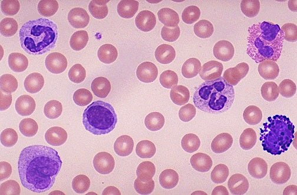
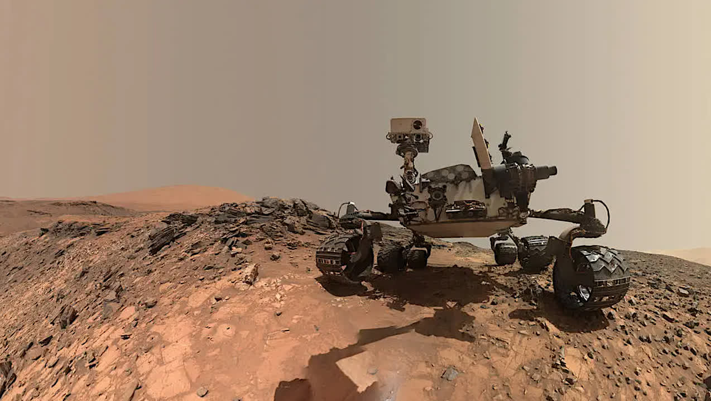

The Artificial Neural Network and Deep Learning course proposed two challenges.
We participated as team "Neural Network November".

## Challenge 1 - Blood Cells - Classification

  

This project focused on developing a neural network for multi-class classification of images representing eight distinct blood cell types. 
The main challenges included addressing class imbalance, generalizing from a relatively small dataset, and ensuring accurate classification. 
To tackle these, we conducted extensive exploratory data analysis to identify and resolve outliers, ambiguities, and class imbalances. 
A multi-stage data augmentation pipeline, culminating in dynamic augmentation during training, was employed to enhance model generalization.
We adopted transfer learning, leveraging pretrained architectures to accelerate learning and adapt the models to the dataset’s specific features.
Model optimization involved hyperparameter tuning, selective layer unfreezing, and mixed precision training. 
Our final submission achieved a local accuracy of 96% and an online hidden test accuracy of 92%.

## Challenge 2 - Mars Terrain - Segmentation

  

In this assignment we were provided with grayscale images of Mars terrain, where each pixel is categorized into one of five terrain classes. 
In this semantic segmentation problem our objective was to assign the correct class label to each pixel in the image. 
To address this challenge, we analyzed the data, built a UNet model, and enhanced its architecture to improve segmentation accuracy.
Several challenges arose during this task. 
Firstly, the small image size limited the detail level, thus blurring class boundaries with varying terrain types.
Class imbalance, with the background class dominating, hurted performance for underrepresented classes, i.e. big rocks. 
Lastly, more generally, the Mars terrain complexity and irregular textures further complicated the model ability to generalize.
In the end, we ranked second among nearly 300 participants scoring 0.74 mean IoU using a Segformer architecture.

###### Python code written by Lorenzo Bianchi, Francesco Ostidich, Matteo Bettiati
